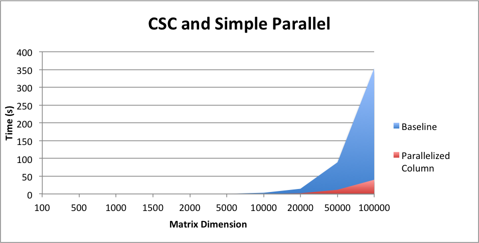
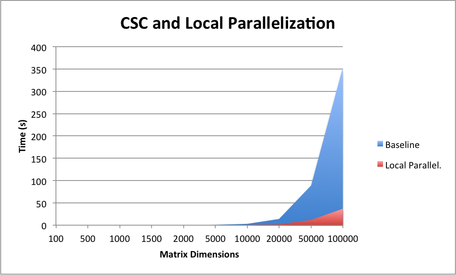

by Anisha Padwekar and Toshitha Jagadeesh

### SUMMARY
We parallelized sparse matrix multiplication in OpenMP on the gates machines varying both storage mechanisms and algorithms

### BACKGROUND
A major part of this project is based on deciding the proper format to store the matrices in. Sparse matrices are created to avoid large memory overhead. This naturally bounds our potential storage forms. Commonly used formats include Compressed Sparse Row (CSR), Compressed Sparse Column (CSC), Rutherford-Boeing, and Market Matrix. Of these CSR and CSC lend themselves most naturally to the row/column based accesses that characterize matrix multiplication, so we decided to focus on them.

CSR and CSC are implemented as an array of C++ vectors. Our program takes in pairs of CSRs or CSCs and returns the result of their multiplication.

On its own, dense matrix multiplication is naturally memory-bound. By representing the matrix as a CSR or a CSC, we add additional memory accesses by the virtue that we cannot simply index into an array, but instead need to search. Many of the standard matrix multiplication techniques can potentially apply but have this additional overhead.

It is important to speedup sparse matrix multiplication as there are a variety of applications that often rely on successive multiplications. Natural Language processing with the sparse distribution of words, recommender systems with sparse user ratings, machine learning, and graph computations are all potential beneficiaries of faster sparse matrix computations. The pagerank we did in class could also be implemented using sparse matrix multiplication.

### APPROACH
This problem is challenging because we will be attempting to speed up the process of multiplying matrices together. We have some ideas from different papers and our prior knowledge in ways to make the multiplication more efficient. However, we will have to test out the different methods such as blocking, etc. Likewise, sparse matrices are different from regular dense matrix multiplication due to the higher presence of zeros. Due to this factor, the matrices themselves can be represented slightly differently in order to make the multiplication more efficient (since 0 values would not need to multiplied).

### RESULTS
We were pretty successful at achieving our goals of achieving speed up with sparse matrix multiplication as seen by the speed up in the graph below. We measured speedup by using the wall-clock time with the OpenMP functions. Note that using the regular clock function provided in the clock library with C++ takes the sum of all the runtimes for all threads spawned; therefore, be cognizant to use the OpenMP clock functions if you are running timing code with parallelized parts. Likewise, we ran our matrix multiplication on very sparse matrices. The matrix dimension found on the x-axis of the graphs represents the number of rows (n) in a matrix (all matrices were square matrices). We created a script that randomly filled out $\frac{n}{2}$ locations in the matrix and ran all of our tests on the generated matrices. We simulated very sparse matrices because we wanted to simmulate a recommendation system which generally are on the order of linear with the matrix dimensions. 

We intially started our analysis by looking at whether to represent our matrices as a CSC or CSR. We created a serial version of the matrix multiplication algorithm and ran it on each of the types of matrix formats. From the graph shown above, we can see that the matrices that were represented as CSC's were slightly faster than the CSR format. Consequently, we decided to use the CSC matrix format as our baseline. 

After picking our baseline, we followed the methods used in class in order to optimize matrix multiplication as much as possible when using the CSC format. Our first implementation involved adding parallelization by adding basic OpenMP for loop around the outer 2 loops which iterate through the first and second matrices used for computation. We did see a deacrease in the amount of time the computation took due to this addition as expected. We can see the exact results below. 

After achieving a fairly efficient speedup, we saw further room for improvement in the way our result matrix was generated. In our serial and simple parallel code, the matrix multiplication would all be stored in a resulting array of vectors that had the characteristics of a dense matrix. Consequently, in order to reduce the overhead of doing the computation and then converting the dense matrix into a sparse one at the end, we decided to immerge this into the computation. In particular, after calculating C[i], where i is the index of the resultant array, we just push the value into in the array only if it is not 0. This way we can keep the data in its CSC format and reduce the amount of time taken to convert the whole matrix to sparse at each row of computation. From the discussed optimization, we achieved a significant amount of speedup as seen in the Speedup graph. We can further look into the graph shown below which displays the time taken for matrix multiplication to occur versus our baseline of having a serial version of the CSC formatted matrix.

Next, we decided to utilize the knowledge gained in lecture on matrix multiplication particularly transposing the matrix and performing the computation. We kept our parallelization from that we used for the simple parallelization computation and added transposing to it. We had high hopes for this optimization especially since Kayvon went over the different ways that transposing could be used to improve the runtime of matrix multiplication. However, as seen in the speedup graph and the runtime graph below, we see that this optimization was much slower than the parallelized version.

We also decided that we want 

###REFERENCES
https://software.intel.com/en-us/node/524555

### LIST OF WORK BY EACH STUDENT
Equal work was performed by both project members.

